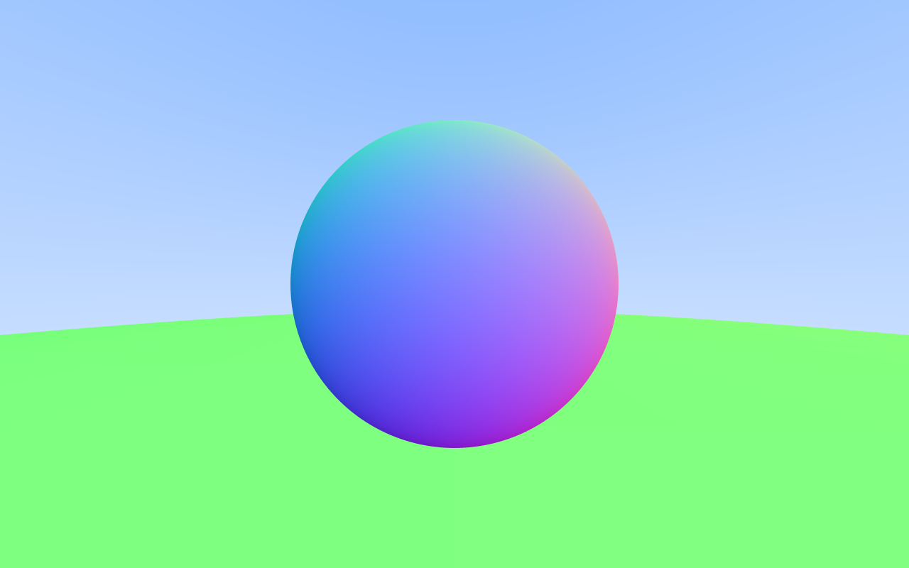
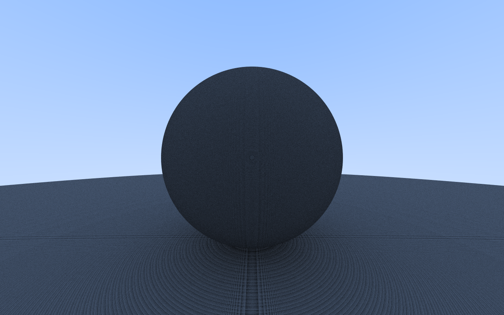
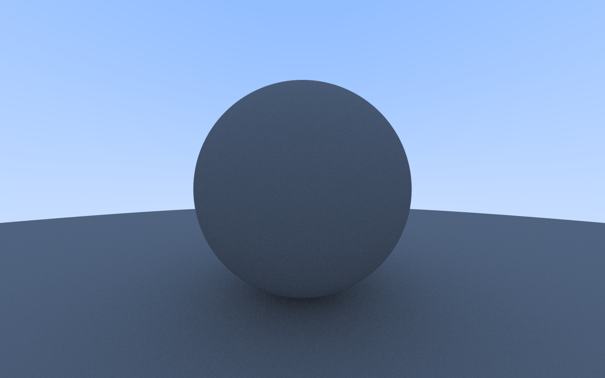
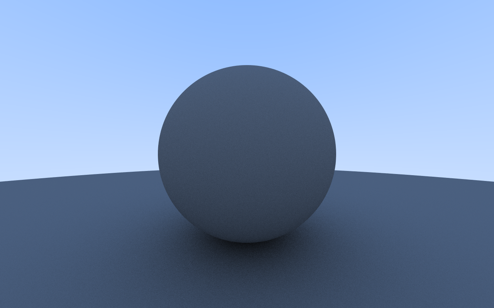
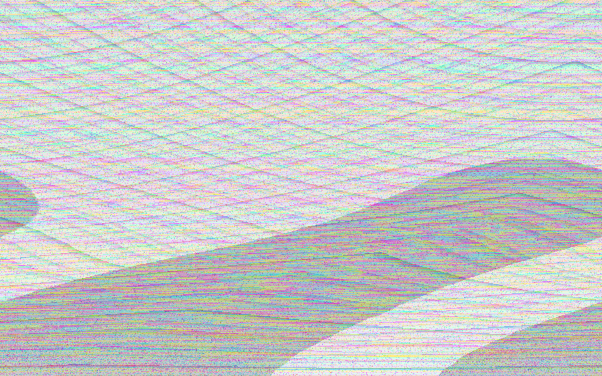
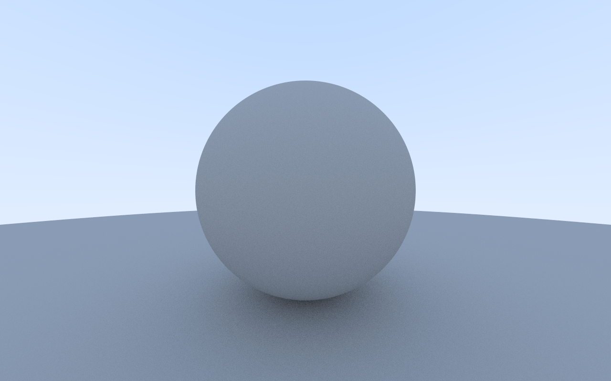
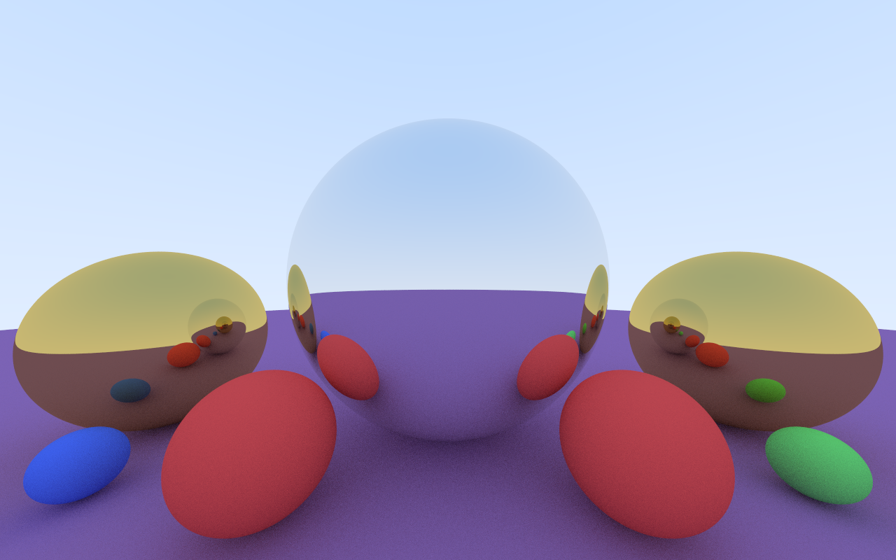

# cuda-raytracer
A simple path tracer written in CUDA.

## Setup
1. Use the nix flake development environment by running `nix develop`. If you do not have Nix setup, read `flake.nix` to see what you need.
2. In the `src/` directory, run `mkdir build && cd build && cmake .. && make`. You will then have a binary you can run.

## Progress
These are some screenshots from throughout development.

#### Surface normals visualization

#### Surface normals with anti-aliasing

#### Uniform diffuse lighting, with a bug

#### Fixed bug

#### Lambertian reflections

#### Broke the ppm export logic

#### Lambertian reflections with gamma correction

#### Material system with Lambertian and metal

